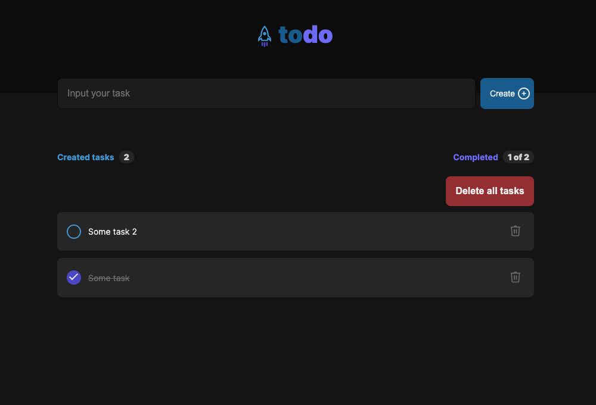

## Cute todo app

https://yevhenonufrii.github.io/simple-toDoList/

## Technology:

1. Vite.js
2. React.js
3. SCSS

Sunnary:

- You can press "Create" button or pres "Enter" to add new task.
- Below the input field, there is an information block that shows the number of created tasks and the number of completed tasks.
- Еhe marked task has other styles and is moved to the end of the list.
- Re-marked completed task returns to the active state.
- You can delete each task separately or you can delete all of them at once by clicking on the "DELETE ALL TASKS" button

